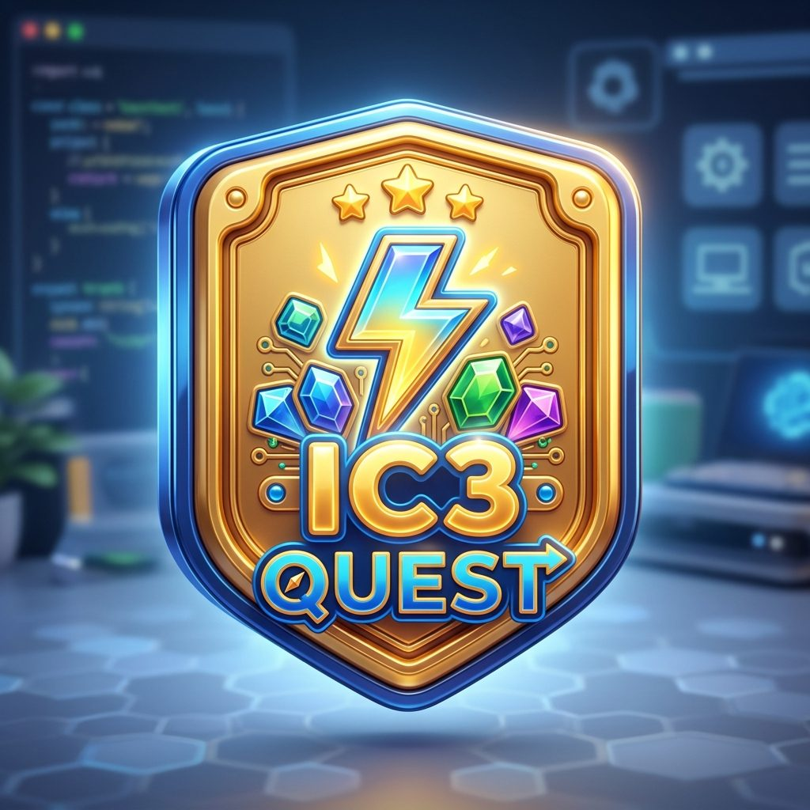

# 🎮 ĐỒ ÁN: HỆ THỐNG LUYỆN THI & HỌC TẬP TIN HỌC CHUẨN QUỐC TẾ IC3 SPARK & GS6 (IC3 QUEST)

<p align="center">
  
</p>

<p align="center">
  <b>Nền tảng số hóa giáo dục phong cách Game Phiêu Lưu (Gamified 3D Adventure) dành cho Học sinh Tiểu học, Giáo viên và Phụ huynh</b>
</p>

<p align="center">
  
  
  
  
  
  
</p>

---

## 📌 1. Giới Thiệu Đề Tài & Mục Tiêu

Đề tài xây dựng nền tảng hỗ trợ dạy và học tin học quốc tế chuẩn **IC3 Spark (Tiểu học: Khối 3, 4, 5)** và **IC3 GS6**, giải quyết các vấn đề khô khan trong ôn luyện trắc nghiệm truyền thống thông qua:
1. **Phương pháp Game hóa (Gamification)**: Trẻ học qua chuyến thám hiểm số, tích lũy Sao Vàng, mở khóa đảo kiến thức, đua top Hiệp sĩ nhí và đổi giờ chơi trò chơi vận động.
2. **Chuẩn hóa Quốc tế**: Ngân hàng câu hỏi bám sát chuẩn kiến thức IIG thế giới, chấm điểm theo thang **1000 điểm**, tự động đánh giá mức độ Đạt/Không đạt.
3. **Hệ sinh thái kết nối 4 bên**: Học sinh ➔ Giáo viên ➔ Phụ huynh ➔ Quản trị viên trên cùng một hệ thống đồng bộ thời gian thực.

---

## 🧠 2. Các Tính Năng Thông Minh & Đột Phá (Điểm Nhấn Đồ Án)

### 🤖 1. Tương Tác Thị Giác Máy Tính AI (Google MediaPipe Computer Vision)
- Tích hợp công nghệ nhận diện cử chỉ bàn tay (**Hand Tracking**) và tư thế cơ thể (**Pose Estimation**) qua Webcam trong các mini-game giáo dục (*Bảo vệ em bé, Né virus, v.v.*).
- Học sinh sau khi hoàn thành bài thi đạt điểm cao sẽ nhận **Sao Vàng**, dùng sao để đổi giờ chơi game vận động tương tác không cần chạm chuột/bàn phím.

### 📊 2. Trợ Lý Phân Tích Lỗ Hổng Kiến Thức (Smart Analytics Radar)
- Hệ thống tự động phân tích kết quả từng lần thi theo 7 chủ đề chuẩn IIG (*Phần cứng, Phần mềm, Internet, An toàn thông tin số...*).
- Vẽ biểu đồ năng lực Radar trực quan, tự động chỉ ra **chủ đề con đang bị yếu** và gợi ý các bài ôn luyện bù đắp kiến thức.
- **Cảnh báo thông minh**: Tự động thông báo đến Phụ huynh và Giáo viên khi học sinh làm sai lọt top quá 3 lần ở cùng một dạng bài.

### 🎯 3. Phòng Thi Trực Quan 3D & Đa Dạng Dạng Câu Hỏi (Question Studio)
- Hệ thống thi trắc nghiệm Arcade 3D với âm thanh phản hồi xúc giác chân thực.
- Hỗ trợ câu hỏi **Điểm ảnh tương tác (Hotspot Image)**: Học sinh bấm trực tiếp vào các nút bấm trên ảnh chụp màn hình máy tính thật.
- Câu hỏi kéo thả, ghép nối thẻ khái niệm và trắc nghiệm đa phương tiện.

### 💳 4. Thanh Toán Tự Động VietQR & PayOS (Kích Hoạt Tức Thì)
- Tạo mã QR thanh toán động chuẩn **VietQR** có chứa mã đơn hàng và số tiền chính xác.
- Bắt Webhook tự động 24/7 từ **PayOS**: Ngay khi quét mã chuyển khoản thành công, hệ thống tự động duyệt kích hoạt gói bản quyền cho Giáo viên trong 3 giây mà không cần thao tác thủ công.

### 📲 5. Bot Quản Trị Telegram 2 Chiều & Bảo Mật Chat ID (`@trikun_cdphp_bot`)
- Tự động bắn thông báo về điện thoại Quản trị viên ngay khi có đơn thuê gói mới hoặc có câu hỏi tư vấn từ khách hàng.
- Cho phép Admin **Duyệt kích hoạt đơn / Hủy đơn** chỉ bằng 1 nút bấm trực tiếp trên giao diện Telegram (Inline Buttons).
- Tra cứu nhanh doanh thu và danh sách đơn chờ duyệt qua lệnh bot (`/doanhthu`, `/choduyet`).
- **Phân quyền Chat ID Whitelist nghiêm ngặt**: Chỉ duy nhất tài khoản Admin được cấp quyền (`TELEGRAM_ADMIN_CHAT_ID`) mới được truy cập dữ liệu quản trị, ngăn chặn tuyệt đối người ngoài xem thông tin nội bộ.

---

## 👥 3. Tài Khoản Thử Nghiệm (Demo Accounts)

> **Mật khẩu chung cho tất cả tài khoản: `123456`**

| Vai trò | Đăng nhập (login) | Mật khẩu | Phạm vi trải nghiệm |
| :--- | :--- | :--- | :--- |
| 🛡️ **Quản Trị Viên** | `admin@ic3.test` hoặc `admin` | `123456` | Toàn quyền quản trị, Question Studio, cấu hình Telegram, bảng giá |
| 👩‍🏫 **Giáo Viên** | `teacher@ic3.test` hoặc `teacher` | `123456` | Quản lý lớp 3A1, biểu đồ Radar học sinh, mua/nâng cấp gói |
| 👦 **Học Sinh** | `HS001` *(mã học sinh)* | `123456` | Vào học, thi thử 1000 điểm, tích sao, chơi game cử chỉ AI |
| 👦 **Học Sinh 2** | `HS002` | `123456` | Học sinh Bảo Nam - lớp 3A1 |
| 👦 **Học Sinh 3** | `HS003` | `123456` | Học sinh Minh Khôi - lớp 3A1 |
| 👨‍👩‍👦 **Phụ Huynh** | Đăng nhập GV → chọn **Góc Phụ Huynh** | - | Dashboard theo dõi con, biểu đồ tiến độ, cảnh báo kiến thức yếu |

> 💡 **Hệ thống hỗ trợ đăng nhập linh hoạt**: Nhập `email`, `mã học sinh (HS001)`, hoặc tên bí danh (`admin`, `teacher`).

---

## 🛠️ 4. Hướng Dẫn Cài Đặt & Chạy Trên Máy Cục Bộ (Localhost)

### Yêu cầu môi trường:
- Khuyên dùng **Laragon** (hoặc XAMPP) trên Windows
- PHP >= 8.3 | MySQL >= 8.0 | Composer | Node.js (>= 20.x)

### Các bước cài đặt:

```bash
# 1. Clone mã nguồn về máy
git clone https://github.com/kuncode1311-cloud/cdphp_MOS.git
cd cdphp_MOS

# 2. Cài thư viện Backend & Frontend
composer install
npm install

# 3. Tạo file cấu hình môi trường
cp .env.example .env
php artisan key:generate

# 4. Cấu hình Database trong .env (mặc định Laragon đã chuẩn):
# DB_CONNECTION=mysql
# DB_HOST=127.0.0.1
# DB_PORT=3306
# DB_DATABASE=MOS
# DB_USERNAME=root
# DB_PASSWORD=

# 5. Tạo database "MOS" rồi import dữ liệu mẫu đầy đủ (30 users, 35 bài luyện, 509 câu hỏi...)
php artisan mos:import-db

# HOẶC dùng MySQL CLI:
# mysql -u root MOS < database/mos.sql

# 6. Tạo liên kết lưu trữ tài nguyên
php artisan storage:link

# 7. Khởi động server
php artisan serve
```

👉 Mở trình duyệt: **`http://localhost/MOS/public`** (Laragon) hoặc **`http://127.0.0.1:8000`** (artisan serve)

### 📦 Nội dung CSDL mẫu đã bao gồm:

| Bảng | Số lượng | Mô tả |
| :--- | :--- | :--- |
| `users` | 30 | Admin (1) + GV (3) + HS (26) |
| `levels` | 3 | Khối 3, 4, 5 |
| `topics` | 21 | 7 chủ đề × 3 khối |
| `practice_tests` | 35 | Bài luyện IC3 sẵn có |
| `questions` | 509 | Ngân hàng câu hỏi đầy đủ |
| `test_attempts` | 257 | Lịch sử thi thử có sẵn để demo |
| `game_transactions` | 152 | Giao dịch Sao Vàng / Giờ chơi |
| `packages` | 4 | Gói bản quyền Giáo viên |


---

## 📂 5. Cấu Trúc Thư Mục Nổi Bật

```text
cdphp_MOS/
├── app/
│   ├── Console/Commands/        # Daemon lắng nghe bot Telegram (telegram:poll)
│   ├── Http/Controllers/       # Các Controller phân hệ (Admin, Learning, Pricing, Auth...)
│   ├── Models/                  # Eloquent Models (User, Question, PracticeTest, Package...)
│   ├── Observers/               # Observer tự động cập nhật số câu hỏi bộ đề
│   └── Services/                # Xử lý nghiệp vụ (PayosService, TelegramService, SubscriptionService)
├── database/
│   ├── migrations/              # Cấu trúc CSDL chuẩn hóa (Users, Levels, Questions, Orders...)
│   └── seeders/                 # Dữ liệu ngân hàng đề thi IC3 và tài khoản kiểm thử
├── public/
│   ├── games/                   # Mã nguồn các trò chơi tương tác AI MediaPipe
│   └── images/                  # Mascot, huy hiệu, logo giao diện
├── resources/
│   ├── css/game-theme.css       # Bộ CSS 3D Gamified Card xúc giác dùng chung
│   └── views/                   # Giao diện Blade phân chia rõ ràng theo từng phân hệ
└── routes/
    └── web.php                  # Định tuyến toàn bộ chức năng hệ thống
```

---

## 📄 6. Kết Luận & Bản Quyền

Đồ án được nghiên cứu và phát triển hoàn chỉnh từ giao diện, kiến trúc CSDL đến nghiệp vụ backend, đáp ứng các tiêu chuẩn hiện đại về bảo mật và trải nghiệm người dùng.  
Mã nguồn phục vụ mục đích học tập và báo cáo đồ án môn học.
