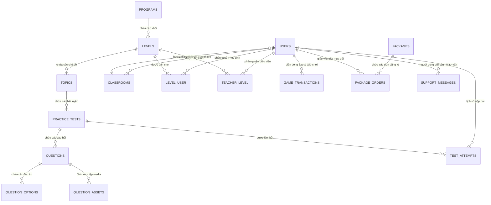

# 📚 TỪ ĐIỂN & BẢN ĐỒ CƠ SỞ DỮ LIỆU TIẾNG VIỆT (HỆ THỐNG IC3 QUEST / MOS)
> **Cập nhật chuẩn xác 100% theo cấu trúc MySQL hiện tại (Ngày 06/09/2026)**  
> Dùng làm tài liệu chuẩn để thiết kế Infographic, Sơ đồ quan hệ thực thể (ERD) và Kiến trúc hệ thống.

---

## 🗺️ Sơ đồ Tổng quan Mối quan hệ (ERD Overview)

---

## 🔗 BẢNG TỔNG HỢP CÁC MỐI QUAN HỆ & KHÓA NGOẠI (DÙNG ĐỂ NỐI DÂY SƠ ĐỒ)

| Bảng Gốc (Chứa Khóa Ngoại) | Cột Khóa Ngoại | Nối Tới Bảng Đích | Cột Khóa Chính | Kiểu Quan Hệ | Ý Nghĩa Thực Tế |
| :--- | :--- | :--- | :--- | :---: | :--- |
| **`levels`** | `program_id` | **`programs`** | `id` | **1 - N** | 1 Chương trình có nhiều Khối lớp (Khối 3, 4, 5) |
| **`topics`** | `level_id` | **`levels`** | `id` | **1 - N** | 1 Khối lớp có 7 Chủ đề học tập |
| **`practice_tests`** | `topic_id` | **`topics`** | `id` | **1 - N** | 1 Chủ đề có nhiều Bài luyện thi |
| **`questions`** | `practice_test_id` | **`practice_tests`** | `id` | **1 - N** | 1 Bài luyện thi có nhiều Câu hỏi |
| **`question_options`** | `question_id` | **`questions`** | `id` | **1 - N** | 1 Câu hỏi có nhiều Phương án/Đáp án lựa chọn |
| **`question_assets`** | `question_id` | **`questions`** | `id` | **1 - N** | 1 Câu hỏi đính kèm nhiều Tệp ảnh/media |
| **`classrooms`** | `teacher_id` | **`users`** | `id` | **1 - N** | 1 Giáo viên chủ nhiệm phụ trách Lớp học |
| **`users`** | `classroom_id` | **`classrooms`** | `id` | **1 - N** | 1 Lớp học có nhiều Học sinh |
| **`users`** | `created_by` | **`users`** | `id` | **1 - N** | 1 Admin tạo ra nhiều tài khoản Giáo viên/Học sinh |
| **`test_attempts`** | `user_id` | **`users`** | `id` | **1 - N** | 1 Học sinh có nhiều Lượt làm bài thi |
| **`test_attempts`** | `practice_test_id`| **`practice_tests`** | `id` | **1 - N** | 1 Đề thi được nộp bởi nhiều Học sinh |
| **`level_user`** | `user_id` | **`users`** | `id` | **N - N** | Bảng trung gian: Học sinh được cấp quyền Khối nào |
| **`level_user`** | `level_id` | **`levels`** | `id` | **N - N** | Bảng trung gian: Khối học được gán cho Học sinh nào |
| **`teacher_level`** | `teacher_id` | **`users`** | `id` | **N - N** | Bảng trung gian: Giáo viên được phụ trách Khối nào |
| **`teacher_level`** | `level_id` | **`levels`** | `id` | **N - N** | Bảng trung gian: Khối học do Giáo viên nào dạy |
| **`game_transactions`** | `user_id` | **`users`** | `id` | **1 - N** | 1 Học sinh có nhiều Giao dịch Sao & Giờ chơi |
| **`package_orders`** | `package_id` | **`packages`** | `id` | **1 - N** | 1 Gói dịch vụ có nhiều Đơn đăng ký thuê |
| **`package_orders`** | `user_id` | **`users`** | `id` | **1 - N** | 1 Giáo viên đặt mua nhiều Đơn thuê gói |
| **`support_messages`** | `user_id` | **`users`** | `id` | **1 - N** | 1 Người dùng/Khách gửi nhiều Tin nhắn tư vấn Live Chat |
| **`game_settings`** | *(Không có)* | *(Bảng độc lập)* | `id` | *(Độc lập)*| Bảng cấu hình hệ thống dạng Key - Value |

---

## 1. 👨‍🎓 Bảng `users` (Tài khoản người dùng)

_Chứa thông tin đăng nhập và ví điểm thưởng của Quản trị viên, Giáo viên và Học sinh._

| Tên Cột (Database) | Kiểu Dữ Liệu | Giải Thích Tiếng Việt | Ví Dụ Dữ Liệu |
| :----------------- | :----------- | :-------------------- | :------------ |
| `id` | Bigint (Khóa chính) | Mã định danh duy nhất của tài khoản | `15` |
| `name` | Varchar(255) | Họ và tên người dùng | `Nguyễn Hoàng Bách` |
| `email` | Varchar(255) (Unique) | Địa chỉ email đăng nhập | `hs001@student.ic3.local` |
| `student_code` | Varchar(255) (Unique) | Mã số học sinh (đăng nhập nhanh) | `HS001` |
| `password` | Varchar(255) | Mật khẩu (đã mã hóa an toàn bcrypt) | `******` |
| `role` | Varchar(255) | Phân quyền vai trò (`admin`, `teacher`, `student`) | `student` |
| `classroom_id` | Bigint (Khóa ngoại) | Thuộc lớp học nào (nếu là học sinh) | `5` (Lớp 4A1) |
| `reward_stars` | Int unsigned | **Ví Sao thưởng tích lũy** (để đổi giờ chơi game) | `4700` |
| `game_time_seconds`| Int unsigned | **Thời gian chơi mini-game còn lại** (tính bằng giây) | `420` (7 phút) |
| `created_by` | Bigint (Khóa ngoại) | Người tạo ra tài khoản này | `1` (Admin) |
| `phone` | Varchar(20) | Số điện thoại liên hệ / Zalo | `0912345678` |
| `school_name` | Varchar(255) | Trường học / Đơn vị công tác (cho giáo viên) | `TH Chu Văn An` |
| `max_students` | Smallint unsigned | Hạn mức tạo học sinh (nếu là giáo viên) | `100` |
| `expires_at` | Date | Hạn sử dụng tài khoản (cho thuê bao/bản quyền) | `2027-06-30` |
| `status` | Varchar(30) | Trạng thái tài khoản (`active`, `pending`, `inactive`) | `active` |
| `created_at` | Timestamp | Thời điểm tạo tài khoản | `2026-08-23 10:30:00` |
| `updated_at` | Timestamp | Thời điểm cập nhật thông tin gần nhất | `2026-09-06 21:00:00` |

---

## 2. 🏫 Bảng `classrooms` (Danh sách lớp học)

_Quản lý danh sách các lớp học, khối lớp và giáo viên phụ trách._

| Tên Cột (Database) | Kiểu Dữ Liệu | Giải Thích Tiếng Việt | Ví Dụ Dữ Liệu |
| :----------------- | :----------- | :-------------------- | :------------ |
| `id` | Bigint (Khóa chính) | Mã định danh lớp học | `5` |
| `name` | Varchar(255) | Tên lớp học | `Lớp 4A1` |
| `grade` | Tinyint unsigned | Khối lớp (`3`, `4`, `5`) | `4` |
| `school_year` | Varchar(255) | Niên khóa học tập | `2026-2027` |
| `teacher_id` | Bigint (Khóa ngoại) | Giáo viên chủ nhiệm phụ trách lớp | `14` |
| `created_at` | Timestamp | Thời điểm tạo lớp | `2026-08-23 10:30:00` |
| `updated_at` | Timestamp | Thời điểm cập nhật gần nhất | `2026-08-23 10:30:00` |

---

## 3. 🗂️ Bảng `programs` (Chương trình đào tạo)

_Chương trình đào tạo gốc (Ví dụ: IC3 GS6 Spark Primary)._

| Tên Cột (Database) | Kiểu Dữ Liệu | Giải Thích Tiếng Việt | Ví Dụ Dữ Liệu |
| :----------------- | :----------- | :-------------------- | :------------ |
| `id` | Bigint (Khóa chính) | Mã định danh chương trình | `8` |
| `name` | Varchar(255) | Tên chương trình | `IC3 GS6 Spark Primary` |
| `slug` | Varchar(255) (Unique) | Đường dẫn tĩnh thân thiện (SEO URL) | `ic3-gs6-primary` |
| `description` | Text | Mô tả chi tiết chương trình | `Chương trình tin học quốc tế chuẩn IC3 GS6` |
| `accent` | Varchar(255) | Mã màu sắc thương hiệu chủ đạo | `#5b5ce2` |
| `created_at` | Timestamp | Thời điểm tạo | `2026-08-22 08:00:00` |
| `updated_at` | Timestamp | Thời điểm cập nhật | `2026-08-22 08:00:00` |

---

## 4. 🏷️ Bảng `levels` (Khối lớp / Cấp độ học tập)

_Phân cấp trình độ theo từng Khối 3 (Level 1), Khối 4 (Level 2), Khối 5 (Level 3)._

| Tên Cột (Database) | Kiểu Dữ Liệu | Giải Thích Tiếng Việt | Ví Dụ Dữ Liệu |
| :----------------- | :----------- | :-------------------- | :------------ |
| `id` | Bigint (Khóa chính) | Mã cấp độ / khối học | `14` |
| `program_id` | Bigint (Khóa ngoại) | Thuộc chương trình nào | `8` |
| `name` | Varchar(255) | Tên hiển thị khối học | `IC3 GS6 Spark Level 1 — Khối 3` |
| `slug` | Varchar(255) | Đường dẫn URL của khối | `spark-level-1` |
| `grade` | Tinyint unsigned | Khối lớp tương ứng (`3`, `4`, `5`) | `3` |
| `position` | Smallint unsigned | Thứ tự sắp xếp hiển thị | `1` |
| `created_at` | Timestamp | Thời điểm tạo | `2026-08-22 08:00:00` |
| `updated_at` | Timestamp | Thời điểm cập nhật | `2026-08-22 08:00:00` |

---

## 5. 📖 Bảng `topics` (Chủ đề bài học)

_7 chủ đề chuẩn quốc tế IC3 trong mỗi khối lớp._

| Tên Cột (Database) | Kiểu Dữ Liệu | Giải Thích Tiếng Việt | Ví Dụ Dữ Liệu |
| :----------------- | :----------- | :-------------------- | :------------ |
| `id` | Bigint (Khóa chính) | Mã chủ đề bài học | `68` |
| `level_id` | Bigint (Khóa ngoại) | Thuộc khối học nào | `14` |
| `name` | Varchar(255) | Tên chủ đề | `Căn bản về công nghệ` |
| `slug` | Varchar(255) | Đường dẫn URL của chủ đề | `chu-de-1` |
| `description` | Text | Mô tả tóm tắt nội dung chủ đề | `Tìm hiểu phần cứng máy tính và thao tác cơ bản` |
| `icon` | Varchar(255) | Tên biểu tượng minh họa | `monitor` |
| `position` | Smallint unsigned | Thứ tự chủ đề (Chủ đề 1, 2, ..., 7) | `1` |
| `created_at` | Timestamp | Thời điểm tạo | `2026-08-22 08:00:00` |
| `updated_at` | Timestamp | Thời điểm cập nhật | `2026-08-22 08:00:00` |

---

## 6. 📝 Bảng `practice_tests` (Bộ đề thi luyện tập)

_Các bài luyện thi chuẩn kiến thức của từng chủ đề._

| Tên Cột (Database) | Kiểu Dữ Liệu | Giải Thích Tiếng Việt | Ví Dụ Dữ Liệu |
| :----------------- | :----------- | :-------------------- | :------------ |
| `id` | Bigint (Khóa chính) | Mã đề thi | `110` |
| `topic_id` | Bigint (Khóa ngoại) | Thuộc chủ đề nào | `68` |
| `name` | Varchar(255) | Tên bài luyện | `Bài luyện 1` |
| `slug` | Varchar(255) | Đường dẫn URL bài luyện | `k3-cd1-bai-1` |
| `launch_path` | Varchar(255) | Đường dẫn phát bài thi tương tác | `tests/spark-l1-t1/index.html` |
| `access_code` | Text | Mã bảo mật mở khóa bài thi (nếu có) | `IC3_PASS_2026` |
| `resource_manifest`| JSON | Danh mục tài nguyên bài thi đính kèm | `{"assets": [...]}` |
| `duration_minutes` | Smallint unsigned | Thời gian làm bài (tính bằng phút) | `20` |
| `question_count` | Smallint unsigned | Số lượng câu hỏi trong đề | `14` |
| `pass_score` | Smallint unsigned | Điểm mốc Đạt chuẩn (thang 1000) | `700` |
| `max_score` | Smallint unsigned | Điểm số tối đa của bài | `1000` |
| `difficulty` | Enum | Mức độ khó (`Cơ bản`, `Trung bình`, `Nâng cao`) | `Cơ bản` |
| `is_published` | Boolean | Trạng thái mở thi (`1`: Mở, `0`: Đóng) | `1` |
| `shuffle_questions`| Boolean | **Trộn ngẫu nhiên thứ tự câu hỏi** (`1`: Bật, `0`: Tắt) | `1` |
| `shuffle_options` | Boolean | **Trộn ngẫu nhiên thứ tự đáp án** (`1`: Bật, `0`: Tắt) | `1` |
| `position` | Smallint unsigned | Thứ tự bài thi trong chủ đề | `1` |
| `created_at` | Timestamp | Thời điểm tạo | `2026-08-22 08:00:00` |
| `updated_at` | Timestamp | Thời điểm cập nhật gần nhất | `2026-09-06 18:00:00` |

---

## 7. 🎯 Bảng `questions` (Ngân hàng câu hỏi)

_Tập hợp các câu hỏi độc lập được hệ thống MOS trực tiếp sở hữu và quản lý._

| Tên Cột (Database) | Kiểu Dữ Liệu | Giải Thích Tiếng Việt | Ví Dụ Dữ Liệu |
| :----------------- | :----------- | :-------------------- | :------------ |
| `id` | Bigint (Khóa chính) | Mã câu hỏi duy nhất | `1535` |
| `practice_test_id` | Bigint (Khóa ngoại) | Thuộc bộ đề thi nào | `110` |
| `external_id` | Varchar(255) | Mã định danh câu hỏi nguồn (nếu có) | `Q_01_SPARK_L1` |
| `type` | Varchar(60) | **Dạng câu hỏi** (Xem 6 dạng bên dưới) | `Hotspot` |
| `title` | Text | Nội dung đề bài câu hỏi | `Em hãy chọn biểu tượng Tìm kiếm...` |
| `configuration` | **JSON** | **Cấu hình nghiệp vụ hiển thị & chấm điểm do MOS sở hữu** *(Đã thay thế `raw_payload` cũ)* | `{"layout": "split", "timer": 60}` |
| `points` | Smallint unsigned | Điểm số của câu hỏi | `1` |
| `position` | Smallint unsigned | Thứ tự câu trong bài thi | `5` |
| `is_published` | Boolean | Trạng thái kích hoạt câu hỏi (`1`: Mở, `0`: Ẩn) | `1` |
| `created_at` | Timestamp | Thời điểm tạo | `2026-08-23 09:00:00` |
| `updated_at` | Timestamp | Thời điểm cập nhật | `2026-09-06 15:00:00` |

> ⚠️ **Lưu ý kiến trúc quan trọng**: Cột `raw_payload` dạng văn bản JSON thô của bên thứ ba đã được **gỡ bỏ hoàn toàn** để đảm bảo tính độc lập và bảo mật dữ liệu. Bảng `questions` hiện dùng cột `configuration` chuẩn hóa.

### 📌 6 Dạng câu hỏi chính trong hệ thống (`type`):
1. **`MultipleChoice`**: Trắc nghiệm 1 đáp án đúng (Radio: A, B, C, D).
2. **`MultipleResponse`**: Trắc nghiệm nhiều đáp án đúng (Checkbox: Chọn 2-3 ô).
3. **`Matching`**: Ghép nối 2 cột (Kéo nối dây laser vế trái sang vế phải).
4. **`MultipleChoiceText`**: Phân loại / Dropdown (Mỗi dòng chọn 1 nhóm phân loại).
5. **`Hotspot`**: Bấm điểm ảnh (Nhấp chọn đúng vị trí trên hình giao diện).
6. **`Sequence`**: Kéo thả sắp xếp thứ tự các bước thực hiện (Bước 1 ➔ Bước 2 ➔ Bước 3).

---

## 8. 🔘 Bảng `question_options` (Phương án & Đáp án lựa chọn)

_Các đáp án lựa chọn A, B, C, D, các cặp ghép nối hoặc tọa độ điểm chạm Hotspot._

| Tên Cột (Database) | Kiểu Dữ Liệu | Giải Thích Tiếng Việt | Ví Dụ Dữ Liệu |
| :----------------- | :----------- | :-------------------- | :------------ |
| `id` | Bigint (Khóa chính) | Mã định danh phương án | `5526` |
| `question_id` | Bigint (Khóa ngoại) | Thuộc câu hỏi nào | `1535` |
| `content` | Text | Nội dung chữ của đáp án | `Phần mềm trình duyệt web` |
| `image_path` | Varchar(255) | Đường dẫn ảnh của đáp án (nếu có) | `/storage/questions/opt1.png` |
| `is_correct` | Boolean | Đáp án đúng hay sai (`1`: Đúng, `0`: Sai) | `1` |
| `position` | Smallint unsigned | Thứ tự đáp án (`0`: A, `1`: B, `2`: C, `3`: D) | `0` |
| `metadata` | JSON | Tọa độ khung chữ nhật Hotspot / Metadata bổ trợ | `{"rect": {"x": 772, "y": 486, "w": 40, "h": 40}}` |
| `created_at` | Timestamp | Thời điểm tạo | `2026-08-23 09:00:00` |
| `updated_at` | Timestamp | Thời điểm cập nhật | `2026-08-23 09:00:00` |

---

## 9. 🖼️ Bảng `question_assets` (Tệp đa phương tiện của câu hỏi)

_Quản lý hình ảnh nền, ảnh sơ đồ, âm thanh gắn với từng câu hỏi._

| Tên Cột (Database) | Kiểu Dữ Liệu | Giải Thích Tiếng Việt | Ví Dụ Dữ Liệu |
| :----------------- | :----------- | :-------------------- | :------------ |
| `id` | Bigint (Khóa chính) | Mã tệp tài nguyên | `412` |
| `question_id` | Bigint (Khóa ngoại) | Đính kèm vào câu hỏi nào | `1535` |
| `kind` | Varchar(30) | Loại tệp (`image`, `audio`, `video`) | `image` |
| `path` | Varchar(255) | Đường dẫn lưu tệp trên server | `/storage/questions/assets/bg-search.png` |
| `original_name` | Varchar(255) | Tên tệp tin gốc khi tải lên | `google_chrome_toolbar.png` |
| `mime_type` | Varchar(255) | Định dạng tệp | `image/png` |
| `metadata` | JSON | Kích thước, tỷ lệ ảnh, thông số kỹ thuật | `{"width": 1024, "height": 768}` |
| `created_at` | Timestamp | Thời điểm tạo | `2026-08-23 09:00:00` |
| `updated_at` | Timestamp | Thời điểm cập nhật | `2026-08-23 09:00:00` |

---

## 10. 📊 Bảng `test_attempts` (Kết quả nộp bài của học sinh)

_Lịch sử thi, bảng điểm, thời gian làm bài phục vụ Đua Top Bảng vàng và Đánh giá năng lực._

| Tên Cột (Database) | Kiểu Dữ Liệu | Giải Thích Tiếng Việt | Ví Dụ Dữ Liệu |
| :----------------- | :----------- | :-------------------- | :------------ |
| `id` | Bigint (Khóa chính) | Mã lượt nộp bài | `1` |
| `user_id` | Bigint (Khóa ngoại) | Học sinh nào thực hiện bài thi | `15` |
| `practice_test_id` | Bigint (Khóa ngoại) | Thuộc bài luyện thi nào | `110` |
| `score` | Smallint unsigned | Điểm số đạt được (thang 1000 chuẩn IC3) | `1000` |
| `correct_answers` | Smallint unsigned | Số câu trả lời đúng | `14` |
| `total_questions` | Smallint unsigned | Tổng số câu hỏi trong bài | `14` |
| `duration_seconds` | Int unsigned | Thời gian làm bài (tính bằng giây) | `689` (11 phút 29 giây) |
| `completed_at` | Timestamp | Thời điểm nộp bài | `2026-09-06 20:15:30` |
| `created_at` | Timestamp | Thời điểm bắt đầu tạo bản ghi | `2026-09-06 20:04:01` |
| `updated_at` | Timestamp | Thời điểm cập nhật điểm số | `2026-09-06 20:15:30` |

---

## 11. 🔑 Bảng `level_user` (Phân quyền truy cập Khối học của Học sinh)

_Quản lý học sinh được phép học và thi những Khối nào (Khối 3, Khối 4, Khối 5)._

| Tên Cột (Database) | Kiểu Dữ Liệu | Giải Thích Tiếng Việt | Ví Dụ Dữ Liệu |
| :----------------- | :----------- | :-------------------- | :------------ |
| `id` | Bigint (Khóa chính) | Mã liên kết | `80` |
| `user_id` | Bigint (Khóa ngoại) | Mã học sinh | `15` |
| `level_id` | Bigint (Khóa ngoại) | Mã khối học được cấp quyền | `14` (Khối 3) |
| `created_at` | Timestamp | Thời điểm cấp quyền | `2026-08-24 14:00:00` |
| `updated_at` | Timestamp | Thời điểm cập nhật | `2026-08-24 14:00:00` |

---

## 12. 👩‍🏫 Bảng `teacher_level` (Phân quyền giảng dạy của Giáo viên)

_Quản lý giáo viên phụ trách chuyên môn của từng Khối lớp._

| Tên Cột (Database) | Kiểu Dữ Liệu | Giải Thích Tiếng Việt | Ví Dụ Dữ Liệu |
| :----------------- | :----------- | :-------------------- | :------------ |
| `id` | Bigint (Khóa chính) | Mã liên kết | `12` |
| `teacher_id` | Bigint (Khóa ngoại) | Mã giáo viên | `14` |
| `level_id` | Bigint (Khóa ngoại) | Mã khối lớp giáo viên phụ trách | `14` (Khối 3) |
| `created_at` | Timestamp | Thời điểm gán quyền | `2026-09-01 08:30:00` |
| `updated_at` | Timestamp | Thời điểm cập nhật | `2026-09-01 08:30:00` |

---

## 13. ⚙️ Bảng `game_settings` (Cấu hình hệ thống Mini-Game & Thưởng)

_Lưu cấu hình động do Quản trị viên điều chỉnh trong Admin Dashboard._

| Tên Cột (Database) | Kiểu Dữ Liệu | Giải Thích Tiếng Việt | Ví Dụ Dữ Liệu |
| :----------------- | :----------- | :-------------------- | :------------ |
| `id` | Bigint (Khóa chính) | Mã cấu hình | `1` |
| `key` | Varchar(255) (Unique) | Khóa cấu hình | `pkg1_stars` hoặc `game_enabled` |
| `value` | Text | Giá trị cấu hình | `500` hoặc `1` |
| `description` | Varchar(255) | Diễn giải chức năng cấu hình | `Số sao cần để đổi Gói 1` |
| `created_at` | Timestamp | Thời điểm tạo | `2026-09-06 12:00:00` |
| `updated_at` | Timestamp | Thời điểm chỉnh sửa gần nhất | `2026-09-06 14:30:00` |

---

## 14. 💳 Bảng `game_transactions` (Nhật ký biến động Sao & Giờ chơi)

_Lưu trữ minh bạch mọi giao dịch: làm bài thi cộng Sao, đổi gói giờ chơi, chơi game trừ giây, admin thưởng nóng._

| Tên Cột (Database) | Kiểu Dữ Liệu | Giải Thích Tiếng Việt | Ví Dụ Dữ Liệu |
| :----------------- | :----------- | :-------------------- | :------------ |
| `id` | Bigint (Khóa chính) | Mã giao dịch | `1` |
| `user_id` | Bigint (Khóa ngoại) | Học sinh nhận/tiêu Sao | `15` |
| `type` | Varchar(255) | Loại giao dịch (`earn`, `exchange`, `play`, `admin_adjust`) | `exchange` |
| `stars_change` | Int | Biến động Sao (`+1000` khi thi xong, `-500` khi đổi gói) | `-500` |
| `time_seconds_change`| Int | Biến động giây chơi game (`+180` khi đổi, `-10` khi chơi) | `+180` |
| `description` | Varchar(255) | Diễn giải chi tiết giao dịch | `Đổi Gói Khởi Động: -500 Sao nhận +3 phút` |
| `created_at` | Timestamp | Thời điểm phát sinh giao dịch | `2026-09-06 20:30:00` |
| `updated_at` | Timestamp | Thời điểm cập nhật | `2026-09-06 20:30:00` |

---

## 15. 📦 Bảng `packages` (Danh mục các gói bản quyền IC3)

_Lưu trữ thông tin các gói bản quyền phần mềm dành cho giáo viên và trường học._

| Tên Cột (Database) | Kiểu Dữ Liệu | Giải Thích Tiếng Việt | Ví Dụ Dữ Liệu |
| :----------------- | :----------- | :-------------------- | :------------ |
| `id` | Bigint (Khóa chính) | Mã định danh gói bản quyền | `1` |
| `name` | Varchar(255) | Tên gói bản quyền | `Gói Khởi Động (Starter)` |
| `slug` | Varchar(255) (Unique)| Đường dẫn tĩnh thân thiện của gói | `starter-3-months` |
| `price` | Decimal(12, 2) | Giá bán niêm yết (VNĐ) | `490000.00` |
| `duration_days` | Int unsigned | Thời hạn bản quyền sử dụng (ngày) | `90` (3 tháng) |
| `max_students` | Int unsigned | Hạn mức số lượng học sinh quản lý | `100` |
| `description` | Text | Mô tả tóm tắt nội dung gói | `Phù hợp lớp học quy mô nhỏ` |
| `features` | Json | Danh sách các quyền lợi đi kèm gói | `["Toàn bộ 3 khối", "Hỗ trợ Zalo"]` |
| `is_active` | Boolean | Trạng thái hiển thị bán (`1`: Có, `0`: Ẩn) | `1` |
| `is_featured` | Boolean | Đánh dấu gói nổi bật / khuyên dùng | `0` |
| `created_at` | Timestamp | Thời điểm tạo gói | `2026-09-15 08:00:00` |
| `updated_at` | Timestamp | Thời điểm chỉnh sửa gần nhất | `2026-09-20 01:30:00` |

---

## 16. 🧾 Bảng `package_orders` (Đơn đặt mua & Kích hoạt gói bản quyền)

_Quản lý toàn bộ đơn hàng thuê gói của Giáo viên, phương thức thanh toán VietQR / Chuyển khoản và trạng thái kích hoạt._

| Tên Cột (Database) | Kiểu Dữ Liệu | Giải Thích Tiếng Việt | Ví Dụ Dữ Liệu |
| :----------------- | :----------- | :-------------------- | :------------ |
| `id` | Bigint (Khóa chính) | Mã đơn hàng nội bộ | `1` |
| `code` | Varchar(50) (Unique) | Mã đơn hàng hiển thị (`ORD-...`) | `ORD-20260918-ABCD` |
| `user_id` | Bigint (Khóa ngoại) | Giáo viên đặt mua gói (liên kết `users.id`) | `14` |
| `package_id` | Bigint (Khóa ngoại) | Gói dịch vụ đã chọn (liên kết `packages.id`) | `2` |
| `package_name` | Varchar(255) | Tên gói tại thời điểm đặt mua | `Gói Tiêu Chuẩn (Standard)` |
| `price` | Decimal(12, 2) | Số tiền thanh toán thực tế (VNĐ) | `990000.00` |
| `duration_days` | Int unsigned | Thời hạn sử dụng cộng thêm (ngày) | `365` |
| `max_students` | Int unsigned | Sĩ số học sinh tối đa được cấp | `300` |
| `payment_method` | Varchar(50) | Phương thức (`payos`, `bank_transfer`) | `bank_transfer` |
| `status` | Varchar(30) | Trạng thái (`pending`, `active`, `rejected`) | `active` |
| `notes` | Text | Ghi chú chuyển khoản / Thông tin liên hệ | `Cô Mai Linh - TH Chu Văn An - 0912345678` |
| `activated_at` | Timestamp | Thời điểm Admin hoặc Hệ thống kích hoạt gói | `2026-09-18 10:30:00` |
| `created_at` | Timestamp | Thời điểm khởi tạo đơn hàng | `2026-09-18 10:00:00` |
| `updated_at` | Timestamp | Thời điểm cập nhật trạng thái đơn | `2026-09-18 10:30:00` |

---

## 17. 💬 Bảng `support_messages` (Hộp thư Live Chat & Tư vấn trực tuyến)

_Lưu trữ tin nhắn khách hàng gửi từ widget Live Chat trên website, đồng bộ 2 chiều tức thì với Telegram Bot quản trị._

| Tên Cột (Database) | Kiểu Dữ Liệu | Giải Thích Tiếng Việt | Ví Dụ Dữ Liệu |
| :----------------- | :----------- | :-------------------- | :------------ |
| `id` | Bigint (Khóa chính) | Mã tin nhắn tư vấn | `1` |
| `user_id` | Bigint (Khóa ngoại) | Tài khoản người dùng (nếu đã đăng nhập) | `14` (hoặc `NULL`) |
| `session_id` | Varchar(255) | Mã phiên duyệt web của khách vãng lai | `sess_987abc123` |
| `name` | Varchar(255) | Họ và tên khách hàng cần tư vấn | `Cô Lan Hương` |
| `phone` | Varchar(20) | Số điện thoại liên hệ / Zalo | `0987654321` |
| `email` | Varchar(255) | Địa chỉ email nhận phản hồi | `lanhuong@gmail.com` |
| `message` | Text | Nội dung câu hỏi / yêu cầu hỗ trợ | `Tôi muốn tư vấn gói Pro School cho trường` |
| `admin_reply` | Text | Câu trả lời phản hồi từ Quản trị viên | `Dạ chào Cô, em đã kích hoạt gói và gọi lại ạ!` |
| `status` | Varchar(30) | Trạng thái (`pending`: chờ liên hệ, `responded`: đã tư vấn) | `responded` |
| `replied_at` | Timestamp | Thời điểm Admin phản hồi tư vấn | `2026-09-18 11:15:00` |
| `created_at` | Timestamp | Thời điểm khách gửi tin nhắn | `2026-09-18 11:00:00` |
| `updated_at` | Timestamp | Thời điểm cập nhật tin nhắn | `2026-09-18 11:15:00` |
